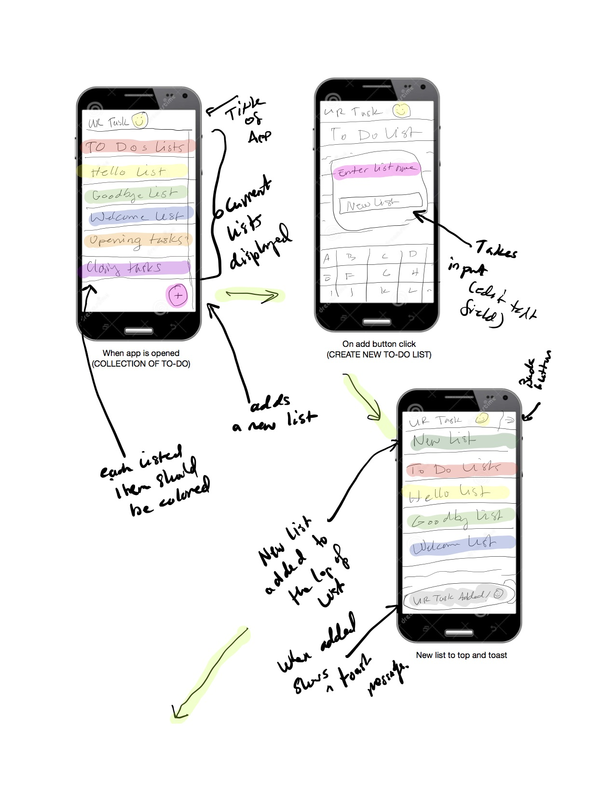
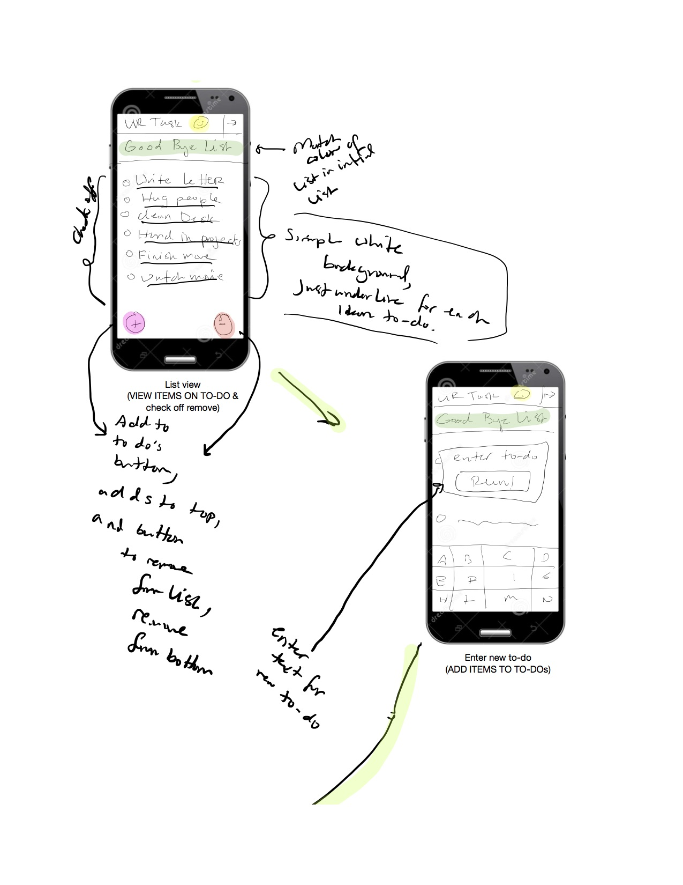
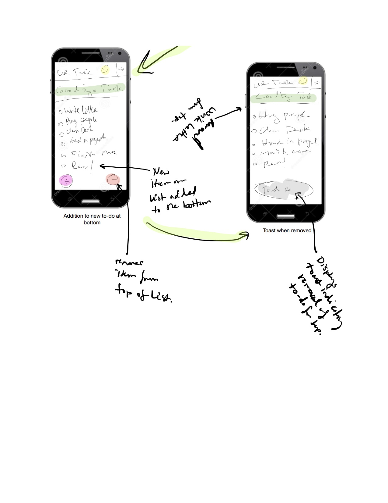
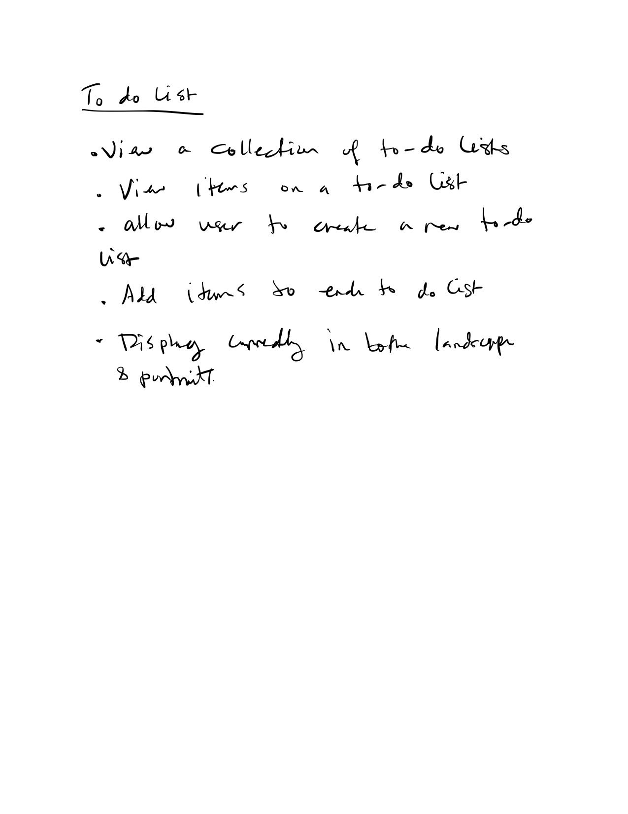

##READ ME: TO-DO LAB

###Welcome to my app: URTask READ ME
###Check out the prototype for URTask
####Below you'll find a breakdown of the apps functions based on the requirments 
####For the requirments check out the breakdown just below the prototyped image!

##Hello,Requirments!
##Broken Down

